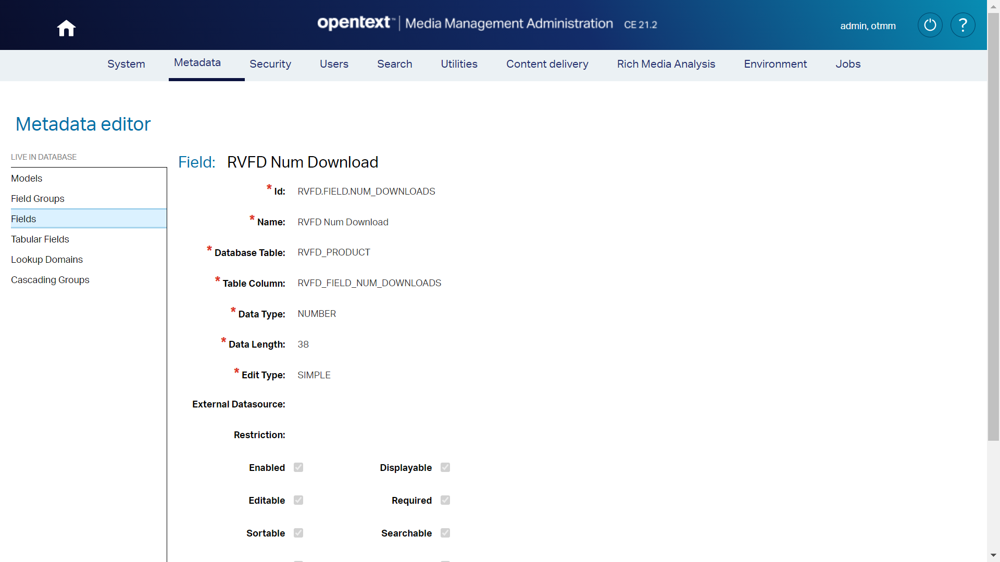
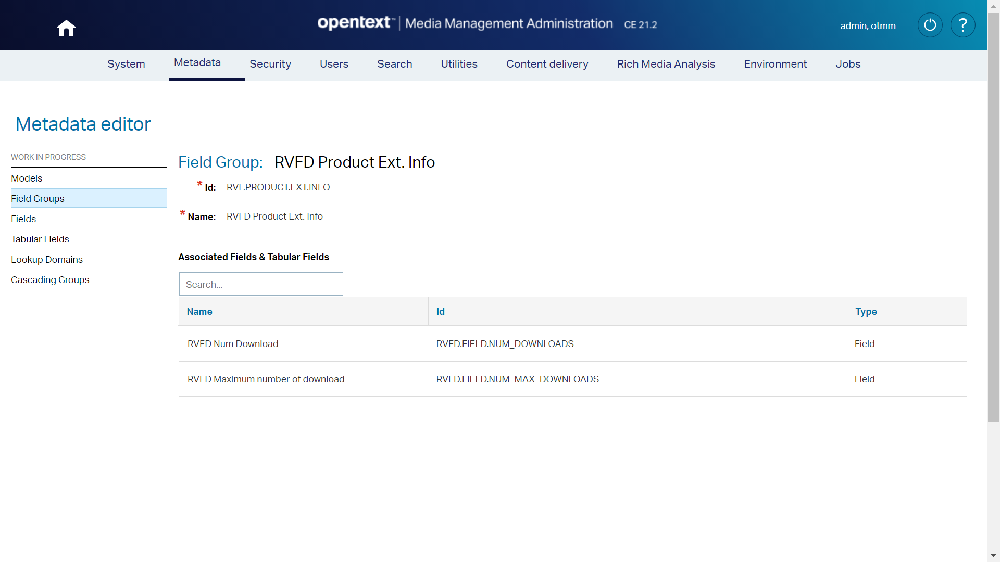
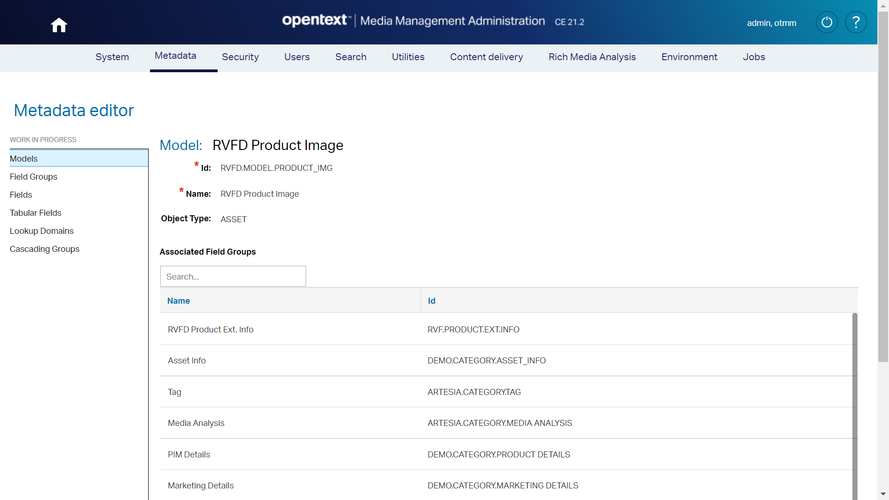
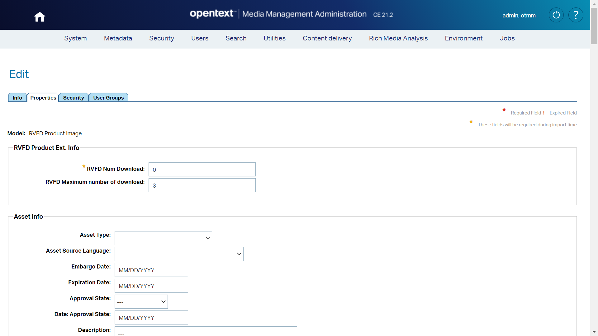

# OpenText Media Management (OTMM) Apply watermark to limited use asset
OTMM Event listener which listen the events:

| EVENT_ID      | DESCR                  |
| ------------- | ---------------------- |
| 1114362       | LAUNCH_DOWNLOAD        |
| 2031680       | EXPORT_LAUNCH_DOWNLOAD |
| 2752513       | FTP DOWNLOAD           |
	
This event is launched once the user downloads an asset.  

This add-on increases the download counter `RVFD.FIELD.NUM_DOWNLOADS`, once the maximum number of downloads is achieved `RVFD.FIELD.NUM_MAX_DOWNLOADS` the asset is watermarked (an the original asset is stored as version).

These metadata are stored in these custom fields: 

```
   - RVFD.FIELD.NUM_DOWNLOADS
   - RVFD.FIELD.NUM_MAX_DOWNLOADS
```

> NOTE: These custom field must be created from TEAMS administration panel.

# Event handler registration

## Register event listener
1.	Copy this paragraph:
```xml 

<!-- Custom event listener (Apply watermark to limited use asset) -->
<listener>
	<listener-class>com.opentext.otmm.sc.eventlistener.ApplyWatermarkToLimitedUseAsset</listener-class>
</listener>
```
 
2.	Open **web.xml** file located at **C:\Apps\MediaManagement\ear\artesia\otmmux\WEB-INF**
3.	Paste the paragraph under the **web-app** label

## Deploy event listener classes
1.	Copy the folder structure under the **&lt;PROJECT_HOME&gt;\bin**
2.	Paste the **com** folder under **C:\Apps\MediaManagement\ear\artesia\otmmux\WEB-INF\classes**

## log4j.xml

Log4j is a simple and flexible logging framework. The most common configuration options issuing  log4j2.xml

Follow these steps:
1.	Copy these text:

```xml 
<!-- Custom added by Joaquín -->
			
<Logger name="com.opentext.otmm.sc.eventlistener" level="DEBUG" additivity="false">
	<AppenderRef ref="CONSOLE"/>
	<AppenderRef ref="FILE"/>
</Logger>	
<Logger name="com.opentext.otmm.sc.eventlistener.handler" level="DEBUG" additivity="false">
	<AppenderRef ref="CONSOLE"/>
	<AppenderRef ref="FILE"/>
</Logger>	
<Logger name="com.opentext.otmm.sc.eventlistener.helper" level="DEBUG" additivity="false">
	<AppenderRef ref="CONSOLE"/>
	<AppenderRef ref="FILE"/>
</Logger>	
<Logger name="com.opentext.otmm.sc.eventlistener.util" level="DEBUG" additivity="false">
	<AppenderRef ref="CONSOLE"/>
	<AppenderRef ref="FILE"/>
</Logger>	
```

2.	Paste the paragraph after the **&lt;/Loggers&gt;** label into **C:\Apps\MediaManagement_TomEE\conf\log4j2.xml**

# Media Management Administration

In order to manage the number of downloads of each asset said in the video you must create some metadata.

## Create a Tabular Metadata table: RVFD_PRODUCT

1. Access to TEAMS (<OTMM_SERVER>/teams)
2. Browse to **Metadata > Custom table editor** at the top menu
3. Click on **Tabular Metadata tables** at the left menu
4. Click on **New Tabular Metadata table** button
5. Create a new table called: **RVFD_PRODUCT**
6. Add two new fields:
   * RVFD_FIELD_BRAND (CHARACTER - 2000)
   * RVFD_FIELD_PRODUCT_TYPE (CHARACTER - 2000)
   * RVFD_FIELD_NUM_DOWNLOADS (NUMBER - 38)
   * RVFD_FIELD_NUM_MAX_DOWNLOADS (NUMBER - 38)
7. Click on **Save** button
      


## Create two Fields: RVFD.FIELD.NUM_DOWNLOADS and RVFD.FIELD.NUM_MAX_DOWNLOADS

1. Browse to **Metadata > Metadata editor** at the top menu
2. Click on **Fields** at the left menu
3. Click on **New  Field** button
4. Create a new field called: **RVFD.FIELD.NUM_DOWNLOADS**
   * **Id**:	RVFD.FIELD.NUM_DOWNLOADS
   * **Name**:	RVFD Num Download
   * **Database Table**: RVFD_PRODUCT
   * **Data Type**: NUMBER
   * **Data Length**: 38
   * **Edit Type**:	SIMPLE
5. Click on **Save** button
6. Add a new field **RVFD.FIELD.NUM_MAX_DOWNLOADS** (repeat steps 3 to 5)
     


## Create a Field Group: RVF.PRODUCT.EXT.INFO		

1. Browse to **Metadata > Metadata editor** at the top menu
2. Click on **Field Groups** at the left menu
3. Click on **New Field Group** button
4. Create a new tabular Field group called: **RVF.PRODUCT.EXT.INFO**
   * **Id**:	RVFD.PRODUCT.EXT.INFO
   * **Name**:	RVFD Product Ext. Info
5. Click on **Available Tabular Fields** tab
6. Search **RVFD** field
7. Select **RVFD.FIELD.NUM_DOWNLOADS** and **RVFD.FIELD.NUM_MAX_DOWNLOADS** fields 
8. Click on **Add selected** button   
9. Click on **Save** button



## Create a Model: Time Based Asset Properties (CUSTOM.MODEL.STOCK VIDEO)		

1. Browse to **Metadata > Metadata editor** at the top menu
2. Click on **Models** at the left menu
3. Click on **New** button
4. Create a new Model called 
   * **Id**: RVFD.MODEL.PRODUCT_IMG
   * **Name**: RVFD Product Image
   * **Object Type**: ASSET
4. Search **RVFD Product Ext. Info** field 
5. Click on **Add selected** button  
6. Repeat steps 4 and 5 for these fields:
   * Asset Info
   * TAg
   * Media Analysis
   * PIM details
   * Marketing details
   * Embeded Description
   * Embedded IPTC
   * Objects
   * Rights & Permissions
   * Intelligent Crop
   * Worflow Audit Information
6. Click on **Save** button



## Validate and apply changes		

Once we have created all the metadata you must deploy your changes in your OTMM instance.

1. Browse to **Metadata > Metadata editor** at the top menu
2. Click on **Validate** button at the bottom of the screen 
3. Click on **Apply** button at the bottom of the screen

## Create a Property template

1. Browse to **Metadata > Property templates** at the top menu
2. Click on **New property template** button
3. Click on **New** button
4. Create a Property template: 
   * Info tab
      * **Id**: RVFD Product Image
   * Properties tab     
      * **Model**:   RVFD Product Image  
      * **RVFD Num Download**: 0
      * **RVFD Maximum number of download**: 3   
   * Security tab
      * Check `RVFD Read only` 
   * User groups
      * Allowed User Groups: Everyone
5. Click on **Save**



# SQL Server Management Studio

Follow these steps:
1.	Open SQL Server Management Studio
2.	Browse to OTMM-BASE (SQL Server - sa) > Databases > MM > Tables
3.	Select table mm.EVENT_CTXTS
4.	Edit row with `EVENT_ID IN ('1114362', '2031680', '2752513')` which corresponds with ‘asset download’ events
5.	Set IS_ENABLED_EXTERNAL = 'Y'


```sql 
UPDATE [mm].[EVENT_CTXTS]
   SET [IS_ENABLED_EXTERNAL] = 'Y'
   WHERE EVENT_ID IN ('1114362', '2031680', '2752513')
GO
```

# Generate project .jar file (in Eclipse)
1. Right click on Project folder
2. Click on **Export**
3. Select **JAR file**
4. Click on **Next**
5. Select only **src** folder at **Select the resource to export** list
6. Check **Select class files an resource**
7. Set **Select the export destination: JAR file**: **OTMM-condition-evaluation.jar**
6. Click on **Finish**

# Required .jar files

> This section is only included to know the original location of the .jar files used in the project.

Import the indicated set of files to the indicated project folders:

**Set 1**
1. From: **C:\Apps\MediaManagement\jars**
 - artesia-server-tools.jar 
 - commons-httpclient-3.1.jar
 - commons-io-2.6.jar 
 - commons-logging-1.2.jar
 - TEAMS-common.jar
 - TEAMS-mock-services.jar
 - TEAMS-sdk.jar
 - TEAMS-toolkit.jar
 
2. To project folder: **lib**

**Set 2**
1. From: **C:\Apps\MediaManagement_TomEE\lib**
 - servlet-api.jar
 
 2. To project folder: **lib**

**Set 3**
1. From: **C:\Apps\MediaManagement\deploy\commons**
 - commons-collections-3.2.2.jar 
 - commons-collections4-4.3.jar 
 - commons-fileupload-1.3.3.jar 
 - commons-lang-2.4.jar 
2. To project folder: **lib**

**Set 4**
1. From: **C:\Apps\MediaManagement\deploy\artesia**
 - otmm-rest-interfaces.jar
 - otmm-server-ext-api.jar
2. To project folder: **lib**


**Set 4**
1. From: **C:\Apps\MediaManagement\ear\artesia\**
 - artesia-ejb.jar
2. To project folder: **lib**